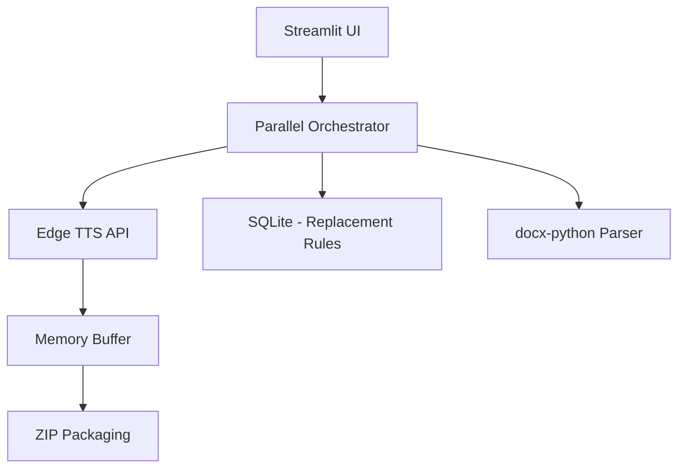

# 軟體設計文件 (SDD) V1：專業 DOCX 轉 MP3 系統

**版本：** 1.0  
**核心技術：** Python, Streamlit, Edge-TTS (Parallel), SQLAlchemy

---

## 1. 系統架構
系統採用 **單一應用程式架構 (Monolithic)**，並透過非同步協程處理高負載的 TTS 請求。

---

## 2. 模組詳細設計

### 2.1 並行調度器 (Orchestrator)
*   **技術**：`asyncio.gather` + `asyncio.Semaphore(3)`。
*   **職責**：將長文切分後的段落同時派發至雲端，限制最大同時連線數為 3，以防止微軟伺服器 Rate Limit。

### 2.2 語音合成組件 (`tts_logic.py`)
*   **本地化映射**：維護 `VOICE_NAME_MAP` 字典，將系統語音 ID 轉換為友善的中文字串。
*   **串流處理**：直接使用 `communicate.stream()` 獲取二進位資料，減少 IO 延遲。

### 2.3 工具集 (`utils.py`)
*   **智慧切分**：`split_text_smartly` 函式。
    *   參數：`max_chars=3000`。
    *   邏輯：從切點向前搜尋標點符號，確保語氣不中斷。
*   **AI 語氣偵測**：`is_important_sentence` 正則表達式。
    *   功能：動態修改 `rate` 與 `pitch` 參數。

### 2.4 資料持久層 (`database.py`)
*   **ORM**：使用 SQLAlchemy 建立 `ReplacementRule` 模型。
*   **初始化**：自動檢測資料表狀態，若為空則執行佛學詞庫初始化。

---

## 3. 介面視覺系統 (CSS System)

### 3.1 色彩變數
*   `--primary-color`: `#B05B77` (乾燥玫瑰)
*   `--header-bg`: `#E8E2D6` (PANTONE 10121 C)
*   `--app-bg`: `#FFFFFF` (純白)
*   `--border-color`: `#D1C9B8` (淺灰沙)

### 3.2 佈局限制
*   **720p 核心**：`.block-container { max-width: 720px; }`。
*   **按鈕家族**：強制覆寫 Streamlit 原生 Button、DownloadButton、FileUploader 樣式，達到視覺 100% 統一。

---

## 4. 關鍵邏輯流程
1.  **DOCX 上傳** ➜ 提取文字。
2.  **文字預處理** ➜ 執行 `[pause]` 語法轉換 ➜ 執行資料庫文字替換。
3.  **並行啟動** ➜ 同時發送 3 個 TTS 請求 ➜ 等待結果。
4.  **封裝交付** ➜ 記憶體二進位流轉 ZIP ➜ 觸發 `st.balloons()` ➜ 觸發 JavaScript `alert` 與桌面通知。
